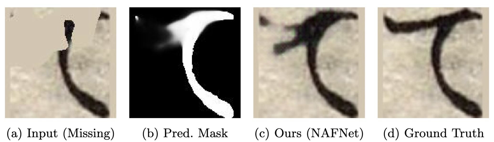

# 🎨 Kuzushiji Restoration: Deep Learning-Based Historical Document Restoration

[](https://www.python.org/downloads/)
[](https://pytorch.org/)
[](LICENSE)

> **Research Project**: A comprehensive benchmark of mask-guided modern architectures for the restoration of physically damaged Kuzushiji (historical Japanese cursive) documents.

---

## 📖 Overview


Historical Japanese documents (Kuzushiji) are vital for cultural research but suffer from significant physical degradation such as stains, scratches, and missing parts. These degradations impede both manual transcription and automated Optical Character Recognition (OCR).

This project proposes a robust two-stage framework:
1. **Damage Localization**: Employs an optimized UNet++ architecture to perform pixel-wise damage segmentation.
2. **Selective Restoration**: Uses the generated masks as guidance (4-channel input: RGB + Mask) across four state-of-the-art architectures (NAFNet, SwinIR, Restormer, MPRNet) to selectively restore the character strokes.

**Key Finding**: Among the evaluated models, **NAFNet** achieves the best performance in terms of perceptual quality (LPIPS) and downstream OCR accuracy, making it the most effective architecture for preserving the delicate structural integrity of cursive strokes.

---

## 🏆 Results Summary

Performance evaluated on an independent test set using Stage 1 Predicted Masks across 5 different damage types.

| Model | Params (M) | FLOPs (G) | PSNR | SSIM | LPIPS ↓ | OCR Acc. ↑ |
|-------|-----------:|----------:|------:|------:|---------:|-----------:|
| **MPRNet**    | 20.13 | 141.6 | 36.98 | 0.9668 | 0.0215 | 97.97% |
| **SwinIR**    | 11.90 | 49.3  | 36.92 | **0.9671** | 0.0229 | 97.96% |
| **Restormer** | 26.10 | 16.1  | 34.40 | 0.9592 | 0.0289 | 97.92% |
| **NAFNet**    | **9.25** | **14.8**  | 36.69 | 0.9650 | **0.0205** | **97.97%** |

> **Conclusion**: NAFNet provides the best trade-off. It achieves top-tier OCR accuracy (matching MPRNet) and the best perceptual quality (LPIPS: 0.0205) while requiring the fewest parameters and lowest computational cost.

---

## 🔬 Methodology

### Two-Stage Pipeline


#### Stage 1: Character Segmentation
- **Architecture**: U-Net++ with SE-ResNeXt-50 encoder.
- **Optimization**: Trained with a hybrid loss function ($0.5\, \text{Dice} + 0.5\, \text{BCE}$) and deep supervision.
- **Goal**: Generate highly precise representations of exactly where the document is damaged.

#### Stage 2: Image Restoration
- **Modified Architectures**: Adapted to accept a 4-channel input (RGB + Mask).
- **Mask Guidance**: Forces the network to focus computational resources on damaged regions while preserving original strokes in clean areas.

### Evaluated Degradation Types
Based on realistic archival damage patterns:
1. **Ghosting**: Ink bleeding from the reverse side.
2. **Missing**: Missing image fragments simulating physical tearing.
3. **Abrasion**: Faded regions from surface wear.
4. **Stain**: Dark, opaque spots overlapping characters.
5. **Transparent Stain**: Semi-transparent, water-damage-like regions.

---

## 📁 Project Structure

```text
Kuzushiji_Restoration/
├── configs/                           # Training Configurations (YAML)
├── models/                            # Model implementations (BasicSR-based)
│   ├── nafnet/                        # Selected NAFNet architecture
│   ├── swinir/
│   ├── restormer/
│   └── mprnet/
├── scripts/
│   ├── data_preprocessing/            # Padding, augmentation, Otsu mask generation
│   ├── evaluation/                    # PSNR, SSIM, LPIPS, OCR evaluation scripts
│   └── restore_with_*.py              # Inference scripts for each architecture
├── environments/                      # Conda environments
└── data/                              # Dataset Directory
    └── full_padded/
        ├── gt/                        # Ground Truth Images
        ├── lq/                        # Low Quality (Degraded) Images
        ├── gt_mask/                   # Ideal Masks
        └── pred_mask/                 # Masks generated by Stage 1 UNet++
```

---

## 🚀 Quick Start

### 1. Environment Setup

```bash
git clone https://github.com/imoto135/Kuzushiji_Restoration.git
cd Kuzushiji_Restoration

# Create Conda environment
conda env create -f environments/env_nafnet2.yml
conda activate nafnet2
```

### 2. Dataset Preparation

Ensure your dataset is placed under `data/full_padded/` following the directory structure above.

```bash
# Example: Generate padding and GT (Otsu) masks
python scripts/data_preprocessing/01_pad_images.py
python scripts/data_preprocessing/02_generate_otsu_masks.py
```

### 3. Inference using NAFNet

Use the provided inference script to run the two-stage pipeline on damaged test images. By default, it uses the directory structure from `data/full_padded/`.

```bash
python scripts/restore_with_nafnet.py \
    --input-dir data/full_padded/lq/test \
    --output-dir outputs/nafnet_test \
    --mask-dir data/full_padded/pred_mask/test
```

### 4. Evaluation

Evaluate the restored images against the ground truth using standard and mask-specific metrics.

```bash
python scripts/evaluation/calculate_5metrics.py \
    --gt_dir data/full_padded/gt/test \
    --restored_dir outputs/nafnet_test \
    --output_csv outputs/nafnet_metrics.csv
```

---

## 📚 References

### Model Architectures
- **NAFNet**: Chen et al., "Simple Baselines for Image Restoration", ECCV 2022 [[Paper]](https://arxiv.org/abs/2204.04676)
- **MPRNet**: Zamir et al., "Multi-Stage Progressive Image Restoration", CVPR 2021 [[Paper]](https://arxiv.org/abs/2102.02808)
- **SwinIR**: Liang et al., "SwinIR: Image Restoration Using Swin Transformer", ICCV 2021 [[Paper]](https://arxiv.org/abs/2108.10257)
- **Restormer**: Zamir et al., "Restormer: Efficient Transformer for High-Resolution Image Restoration", CVPR 2022 [[Paper]](https://arxiv.org/abs/2111.09881)
- **UNet++**: Zhou et al., "UNet++: A Nested U-Mac Architecture for Medical Image Segmentation" [[Paper]](https://arxiv.org/abs/1807.10165)

### Dataset
- **Kuzushiji Dataset**: Center for Open Data in the Humanities (CODH)

---

## 📄 License

This project is licensed under the MIT License.

### Third-Party Licenses
- BasicSR: [Apache License 2.0](https://github.com/XPixelGroup/BasicSR/blob/master/LICENSE)
- NAFNet, SwinIR: Apache License 2.0
- MPRNet, Restormer: MIT License

---

## 👤 Author

**Imoto** — [@imoto135](https://github.com/imoto135)

