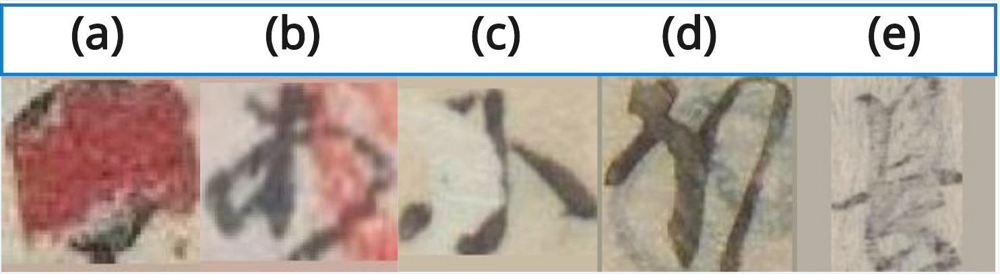
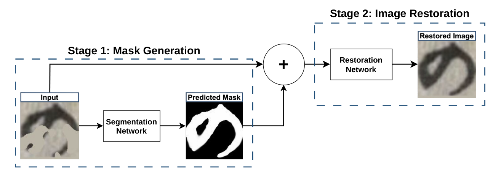
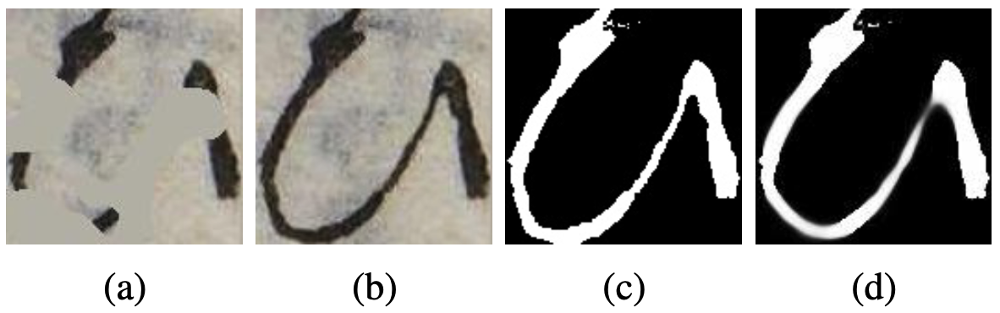

# Kuzushiji Restoration: Mask-Guided Two-Stage Framework

<p align="center">
  <a href="https://www.python.org/downloads/"></a>
  <a href="https://pytorch.org/"></a>
  <a href="LICENSE"></a>
  <a href="https://github.com/imoto135/Kuzushiji_Restoration/stargazers"></a>
  <a href="https://github.com/imoto135/Kuzushiji_Restoration/issues"></a>
</p>

> **個人研究プロジェクト** — 物理的に損傷した*くずし字*（古典日本語くずし字）文書の復元に向けた、マスクガイド付き二段階フレームワークの設計・実装・比較評価

---

## 🔍 プロジェクト概要 (What & Why)

歴史的な日本語文書（くずし字）は文化研究において非常に重要ですが、経年劣化（染み・欠損・にじみ等）によって可読性が大きく損なわれています。本プロジェクトでは、**「まず損傷箇所を検出し、その情報を使って復元する」という二段階アプローチ**を独自設計し、4種の最先端アーキテクチャで比較検証しました。

**このプロジェクトで取り組んだ主なチャレンジ：**
- 汎用的な画像復元手法をドメイン固有（筆跡・細線）問題に適応させる
- ハードマスクではなくソフトマスクを導入し、劣化の曖昧さに対応
- OCR精度という実用指標まで含めた多面的な評価体制の構築

---

## 🎬 デモ・結果

### 対象とする劣化パターン

<p align="center">
  
</p>
<p align="center">
  <em>(a) Stain &nbsp;|&nbsp; (b) Transparent Stain &nbsp;|&nbsp; (c) Missing &nbsp;|&nbsp; (d) Ghosting &nbsp;|&nbsp; (e) Abrasion</em><br>
  <sub>実際の古典文書に見られる5種類の物理的劣化。繊細な筆跡と重なるため、原本の墨跡との区別が困難。</sub>
</p>

### フレームワーク結果

<p align="center">
  
  &nbsp;&nbsp;
  
  &nbsp;&nbsp;
  
</p>
<p align="center">
  <em>左: フレームワーク概要 &nbsp;|&nbsp; 中: Stage 1 損傷検出 &nbsp;|&nbsp; 右: Stage 2 復元結果</em>
</p>

---

## 🔬 技術的な取り組み (How)

### フレームワーク設計

```
損傷画像 (RGB)
    │
    ▼
[Stage 1] UNet++ → ソフト損傷マスク  M̂ ∈ [0, 1]
    │
    ▼ (RGB + Mask = 4ch入力)
[Stage 2] NAFNet / SwinIR / Restormer / MPRNet / MambaIR → 復元画像
```

**🔎 Stage 1 — 損傷局所化**  
UNet++ をベースに、ピクセルごとの劣化確率を表す**ソフトマスク**を生成。バイナリマスクでは表現できない「グラデーションのある損傷領域」を扱えるよう設計しました。

**🛠 Stage 2 — マスクガイド付き復元**  
予測マスクを第4チャンネルとして結合した **4ch入力**を採用し、損傷箇所の情報を復元モデルに明示的に与えます。

### 独自の工夫

| 工夫 | 内容 | 採用の理由 |
|:---|:---|:---|
| **ソフトマスク** | ハード二値化ではなく確率値 $\hat{M} \in [0,1]$ | 歴史文書の劣化は境界が曖昧で二値化による情報損失を防ぐため |
| **CharbPercep 損失** | Charbonnier Loss + Perceptual Loss の混合 | TV損失はくずし字の細かい筆跡を過度に平滑化することをアブレーションで確認 |
| **OCR評価の組込み** | PSNR/SSIM/LPIPS に加えてOCR精度で評価 | 視覚的品質だけでなく「実際に読めるか」という実用性を検証するため |
| **5種の劣化シミュレーション** | 欠損・染み・擦れ・重ね・透明染み | 実際の古文書に見られる多様な劣化パターンを網羅するため |

---

## 📊 結果・評価

### 🔍 Stage 1 — マスク生成（UNet++ による文字領域推定）

**アーキテクチャ比較**（エンコーダー: SE-ResNeXt50 に統一）

| モデル | F1-score↑ | Hard IoU↑ | Soft IoU↑ | MAE↓ |
| :--- | :---: | :---: | :---: | :---: |
| DeepLabV3+ | 0.8295 | 0.7420 | 0.6986 | 0.0989 |
| U-Net | 0.9669 | 0.9409 | 0.9278 | 0.0180 |
| **UNet++ (採用)** | **0.9699** | **0.9472** | **0.9345** | **0.0176** |

**損傷タイプ別精度**（最終モデル: UNet++ + SE-ResNeXt50 + Input Dropout）

| 損傷タイプ | F1-score↑ | Hard IoU↑ | Soft IoU↑ | MAE↓ |
| :--- | :---: | :---: | :---: | :---: |
| Missing（欠損） | 0.9608 | 0.9276 | 0.8977 | 0.0176 |
| Ghosting（裏写り） | 0.9784 | 0.9592 | 0.9299 | 0.0121 |
| Stain（染み） | 0.9620 | 0.9293 | 0.8990 | 0.0178 |
| Abrasion（摩耗） | 0.9560 | 0.9195 | 0.8911 | 0.0186 |
| Transparent Stain（半透明染み） | 0.9816 | 0.9651 | 0.9357 | 0.0107 |

> **考察**: Input Dropout（CoarseDropout）を追加することで F1=0.9719 / Hard IoU=0.9504 を達成。境界が明確な Ghosting・Transparent で特に高精度。Abrasion は摩耗によるストロークの細さが損傷ノイズと類似するため若干低下。

---

### 🖼 Stage 2 — 修復精度（full_padded データセット）

マスク条件 3種類で 5 モデルを比較：**NoMask**（ガイドなし）/ **PredMask**（提案手法）/ **GTMask**（理論上限）  
**太字**・<u>下線</u>は PredMask 条件内でそれぞれ 1 位・2 位を示します。

| モデル | 条件 | mPSNR↑ | mSSIM↑ | LPIPS↓ | OCR精度↑ |
| :--- | :--- | :---: | :---: | :---: | :---: |
| **MPRNet** | NoMask | 33.32 | 0.9613 | 0.0222 | 97.86% |
| | **PredMask (提案)** | **33.50** | <u>0.9627</u> | <u>0.0215</u> | **97.97%** |
| | GTMask (上限) | 35.92 | 0.9769 | 0.0158 | 98.38% |
| **NAFNet** | NoMask | 33.49 | 0.9622 | 0.0221 | 97.91% |
| | **PredMask (提案)** | <u>33.21</u> | 0.9609 | **0.0205** | **97.97%** |
| | GTMask (上限) | 33.89 | 0.9705 | 0.0189 | 98.39% |
| **SwinIR** | NoMask | 33.44 | 0.9618 | 0.0227 | 97.83% |
| | **PredMask (提案)** | **33.50** | **0.9632** | 0.0229 | <u>97.96%</u> |
| | GTMask (上限) | 35.94 | 0.9780 | 0.0174 | 98.42% |
| **Restormer** | NoMask | 30.64 | 0.9543 | 0.0293 | 97.91% |
| | **PredMask (提案)** | 31.47 | 0.9532 | 0.0289 | 97.92% |
| | GTMask (上限) | 33.17 | 0.9692 | 0.0229 | 98.36% |
| **MambaIR** ¹ | NoMask | 37.45 | 0.9695 | 0.02356 | 97.35% |
| | **PredMask (提案)** | 37.53 | 0.9699 | 0.02296 | 97.35% |
| | GTMask (上限) | **39.71** | **0.9754** | **0.01783** | **97.80%** |

¹ MambaIR のみ `hiragana_fulldataset_5stain` データセットで評価（他は `full_padded`）。

> **考察**: PredMask 条件は NoMask を上回るケースが多く、Stage 1 で得た損傷情報が復元に有効に機能していることを確認。GTMask とのギャップは Stage 1 精度改善の余地を示しており、今後の課題として位置づけています。

---

### 3. OCR評価の詳細（`models/classifier/`）

視覚品質指標（PSNR/SSIM/LPIPS）だけでなく、**「実際に文字として読めるか」**という実用指標を加えるため、くずし字分類器を独自に設計・学習しました。

| 項目 | 内容 |
|:---|:---|
| **アーキテクチャ** | ResNet-18（ImageNet事前学習済み、最終FC層を差し替えてFine-tuning） |
| **分類クラス数** | 78クラス（ひらがな文字種、ファイル名のUnicodeプレフィックスから自動取得） |
| **学習データ** | 訓練: 108,536枚 / 検証: 13,567枚 |
| **入力前処理** | グレースケール→RGB変換、224×224リサイズ、RandomRotation (±10°)・RandomAffine (translate=0.1)・ImageNet正規化 |
| **最適化** | SGD (momentum=0.9, weight_decay=1e-4)、ReduceLROnPlateau (factor=0.1, patience=2) |
| **Early Stopping** | patience=5、Epoch 12 で収束 |
| **検証精度** | **98.72%** |

> 実装: [models/classifier/train_classifier.py](models/classifier/train_classifier.py) / 推論: [models/classifier/evaluate_restoration_local.py](models/classifier/evaluate_restoration_local.py)

この分類器を復元画像に適用してOCR精度を算出することで、復元手法の「文字認識への実用的な貢献度」を定量評価しています。HorizontalFlipを意図的に除外するなど、くずし字の方向性を考慮したAugmentation設計も行いました。

---

### 4. 計算効率（NVIDIA RTX A6000、$128 \times 128 \times 4$ 入力）

| モデル | パラメータ数 (M)↓ | FLOPs (G)↓ | レイテンシ (ms)↓ |
| :--- | :---: | :---: | :---: |
| **MPRNet** | 20.13 | 141.6 | <u>12.5</u> |
| **SwinIR** | <u>11.90</u> | 49.3 | 28.2 |
| **Restormer** | 26.10 | <u>16.1</u> | 18.4 |
| **NAFNet** | **9.25** | **14.8** | **8.1** |
| **MambaIR** | 1.48 | — | — |

> NAFNet は最軽量かつ最速でありながら、LPIPS・OCR精度でも競合するパフォーマンスを発揮。**精度と効率のバランスに最も優れたモデル**と評価しています。

---

## 🛠 技術スタック

<p align="center">
  
  
  
  
  
  
  
</p>

| カテゴリ | 技術 |
|:---|:---|
| **Deep Learning** | PyTorch, BasicSR |
| **復元モデル** | NAFNet, SwinIR, Restormer, MPRNet, MambaIR |
| **検出モデル** | UNet++ (SE-ResNeXt-50 バックボーン) |
| **評価指標** | PSNR, SSIM, LPIPS, OCR (ResNet-18 分類器) |
| **実験管理** | Weights & Biases (wandb) |
| **環境** | Docker, Conda, NVIDIA RTX A6000 |

---

## 📁 プロジェクト構成

```
Kuzushiji_Restoration/
├── configs/                   # 各モデルの学習設定 (YAML)
├── models/
│   ├── nafnet/                # NAFNet 実装 (BasicSRベース)
│   ├── swinir/                # SwinIR 実装
│   ├── restormer/             # Restormer 実装
│   ├── mprnet/                # MPRNet 実装
│   ├── mamba/                 # MambaIR 実装
│   ├── unet++/                # Stage 1: 損傷マスク検出
│   ├── classifier/            # OCR評価用分類器
│   └── joint/                 # Joint End-to-End 学習
├── scripts/
│   ├── data_preprocessing/    # 前処理: パディング・Otsuマスク生成・劣化合成
│   ├── evaluation/            # 評価: PSNR / SSIM / LPIPS / OCR
│   └── inference/             # 推論スクリプト
└── data/
    └── hiragana_fulldataset_5stain/
        ├── gt/                # 正解画像
        ├── lq/                # 劣化入力画像
        ├── gt_mask/           # GTマスク (Otsu二値化)
        └── pred_mask/         # Stage 1 予測ソフトマスク
```

---

## 🚀 セットアップ & 実行方法

### 環境構築

**Option A: Docker（推奨）**

```bash
docker compose build
docker compose run --rm kuzushiji bash
```

コンテナ内では `/workspace/Kuzushiji_Restoration` にリポジトリが配置されます。

**Option B: Conda**

```bash
git clone https://github.com/imoto135/Kuzushiji_Restoration.git
cd Kuzushiji_Restoration
conda env create -f environments/env_restoration.yml
conda activate nafnet2
```

### データ前処理

```bash
python scripts/data_preprocessing/01_pad_images.py          # パディング
python scripts/data_preprocessing/02_generate_otsu_masks.py # GTマスク生成
python scripts/data_preprocessing/03_add_stain_5types.py    # 劣化合成 (5種)
```

### 推論

```bash
# Stage 1: 損傷マスク予測
python scripts/inference/predict_mask_unetpp.py \
    --input_dir data/full_padded/lq \
    --output_dir outputs/pred_masks_unetpp \
    --model_path models/unet++/experiments/unet++_full_characters/best_model.pth

# Stage 2: NAFNet による復元
python scripts/restore.py \
    --model_type nafnet \
    --weights path/to/nafnet_checkpoint.pth \
    --input_dir data/full_padded/lq/test \
    --output_dir outputs/nafnet_test \
    --mask_dir data/full_padded/pred_mask/test

# Stage 2: MambaIR による復元 (5stainデータセット)
python models/mamba/restore_mamba_5stain.py \
    --mask_type predmask \
    --weights models/mamba/experiments/MambaIR_5stain_Predmask/best_model.pth \
    --input_dir data/hiragana_fulldataset_5stain/lq/test \
    --mask_dir  data/hiragana_fulldataset_5stain/pred_mask/test \
    --output_dir outputs/mamba_5stain/predmask/test
```

### 評価

```bash
python scripts/evaluation/calculate_5metrics.py \
    --gt_dir data/full_padded/gt/test \
    --pred_dir outputs/nafnet_test \
    --mask_dir data/full_padded/gt_mask/test \
    --output_csv outputs/nafnet_metrics.csv \
    --use_wandb
```

---

## 📚 参考文献

### モデルアーキテクチャ
- **NAFNet**: Chen et al., "Simple Baselines for Image Restoration", ECCV 2022 [[Paper]](https://arxiv.org/abs/2204.04676)
- **MPRNet**: Zamir et al., "Multi-Stage Progressive Image Restoration", CVPR 2021 [[Paper]](https://arxiv.org/abs/2102.02808)
- **SwinIR**: Liang et al., "SwinIR: Image Restoration Using Swin Transformer", ICCV 2021 [[Paper]](https://arxiv.org/abs/2108.10257)
- **Restormer**: Zamir et al., "Restormer: Efficient Transformer for High-Resolution Image Restoration", CVPR 2022 [[Paper]](https://arxiv.org/abs/2111.09881)
- **MambaIR**: Guo et al., "MambaIR: A Simple Baseline for Image Restoration with State-Space Model", ECCV 2024 [[Paper]](https://arxiv.org/abs/2402.15648)
- **UNet++**: Zhou et al., "UNet++: A Nested U-Net Architecture for Medical Image Segmentation" [[Paper]](https://arxiv.org/abs/1807.10165)

### データセット
- **くずし字データセット**: 人文学オープンデータ共同利用センター (CODH)

---

## ⚖️ ライセンス

本プロジェクトは MIT ライセンスのもとで公開しています。

**サードパーティライセンス**
- BasicSR: [Apache License 2.0](https://github.com/XPixelGroup/BasicSR/blob/master/LICENSE)
- NAFNet, SwinIR: Apache License 2.0
- MPRNet, Restormer: MIT License

---

## 👤 作者

**Imoto** — [@imoto135](https://github.com/imoto135)
