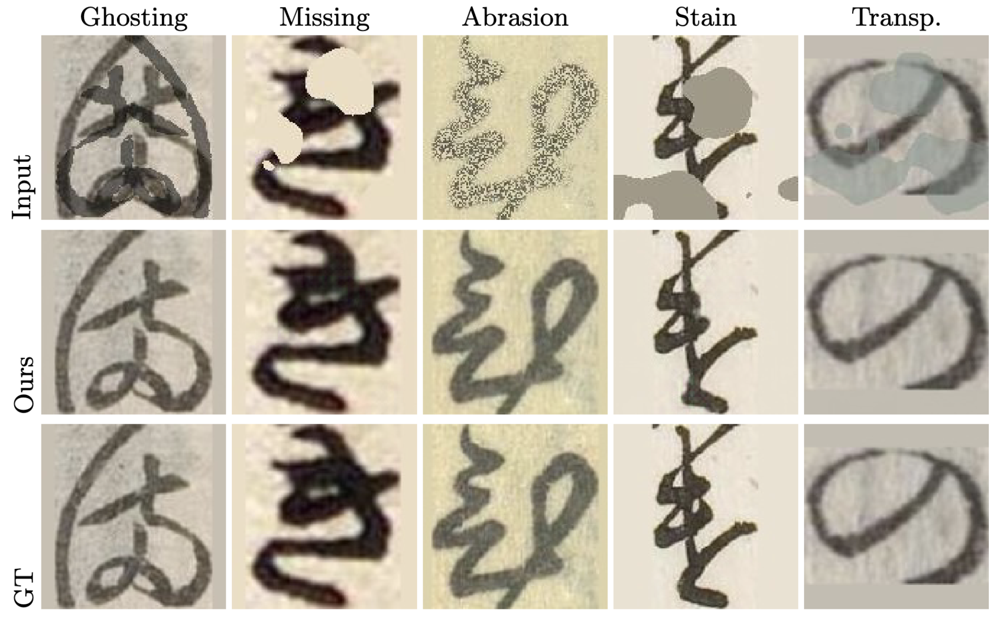

# Kuzushiji Restoration: Mask-Guided Two-Stage Framework

[](https://www.python.org/downloads/)
[](https://pytorch.org/)
[](LICENSE)

> **Research Project**: A comprehensive benchmark of mask-guided modern architectures for the restoration of physically damaged *Kuzushiji* (historical Japanese cursive) documents.

---

## Overview


Historical Japanese documents (*Kuzushiji*) are vital for cultural research but suffer from physical degradation such as stains, missing fragments, and ink bleeding. This project proposes a **two-stage framework** to selectively restore these documents:

1.  **Stage 1: Damage Localization**: Employs an optimized **UNet++** to generate a **soft damage mask** ($\hat{M} \in [0, 1]$), representing pixel-wise degradation probability.
2.  **Stage 2: Selective Restoration**: Uses the predicted soft mask as guidance (**4-channel input**: RGB + Mask) across four modern architectures (**NAFNet, SwinIR, Restormer, MPRNet**) to reconstruct character strokes.

---

## Results & Benchmarks

### 1. Restoration and OCR Performance
The following table compares performance under three mask conditions: **NoMask** (no guidance), **PredMask** (our proposed Stage 1 output), and **GTMask** (theoretical upper bound). 

**Bold** and <u>underline</u> indicate the best and second-best performance within the **PredMask** condition.

| Model | Condition | mPSNR↑ | mSSIM↑ | LPIPS↓ | OCR Acc.↑ |
| :--- | :--- | :---: | :---: | :---: | :---: |
| **MPRNet** | NoMask | 33.32 | 0.9613 | 0.0222 | 97.86% |
| | **PredMask (Ours)** | **33.50** | <u>0.9627</u> | <u>0.0215</u> | **97.97%** |
| | GTMask | 35.92 | 0.9769 | 0.0158 | 98.38% |
| **NAFNet** | NoMask | 33.49 | 0.9622 | 0.0221 | 97.91% |
| | **PredMask (Ours)** | <u>33.21</u> | 0.9609 | **0.0205** | **97.97%** |
| | GTMask | 33.89 | 0.9705 | 0.0189 | 98.39% |
| **SwinIR** | NoMask | 33.44 | 0.9618 | 0.0227 | 97.83% |
| | **PredMask (Ours)** | **33.50** | **0.9632** | 0.0229 | <u>0.9796%</u> |
| | GTMask | 35.94 | 0.9780 | 0.0174 | 98.42% |
| **Restormer**| NoMask | 30.64 | 0.9543 | 0.0293 | 97.91% |
| | **PredMask (Ours)** | 31.47 | 0.9532 | 0.0289 | 97.92% |
| | GTMask | 33.17 | 0.9692 | 0.0229 | 98.36% |

### 2. Computational Efficiency
Measured with $128 \times 128 \times 4$ input on an NVIDIA RTX A6000.

| Model | Params (M)↓ | FLOPs (G)↓ | Latency (ms)↓ |
| :--- | :---: | :---: | :---: |
| **MPRNet** | 20.13 | 141.6 | <u>12.5</u> |
| **SwinIR** | <u>11.90</u> | 49.3 | 28.2 |
| **Restormer** | 26.10 | <u>16.1</u> | 18.4 |
| **NAFNet (Ours)** | **9.25** | **14.8** | **8.1** |

---

## Methodology

### Soft Mask Guidance
To handle the ambiguity of historical degradations (e.g., blurred stains), we use **Soft Masks ($\hat{M} \in [0, 1]$)** instead of hard binary masks. This allows Stage 2 models to account for the intensity of degradation, leading to smoother transitions.

### Optimization: CharbPercep
We adopted a hybrid loss function combining **Charbonnier Loss** and **Perceptual Loss**. Our ablation study showed that **CharbPercep** preserves the structural integrity of cursive strokes (*renmen*), whereas traditional TV loss tends to over-smooth fine details.

### Ground-Truth Labels
Ground-Truth masks were generated by applying **Otsu's binarization** to clean historical images, providing an objective character localization baseline.

---

## Project Structure
```text
Kuzushiji_Restoration/
├── configs/               # Training YAML files
├── models/                # Model implementations (BasicSR-based)
├── scripts/
│   ├── data_preprocessing/# Otsu mask generation, padding
│   ├── evaluation/        # Metrics (PSNR, SSIM, LPIPS, OCR)
│   └── restore_with_*.py  # Inference scripts
└── data/
    └── hiragana_fulldataset_5stain/
        ├── gt/            # Ground Truth Images
        ├── lq/            # Degraded Images
        ├── gt_mask/       # Ideal Masks (Otsu-based)
        └── pred_mask/     # Stage 1 Predicted Soft Masks
```

---

## Quick Start

### 1. Environment Setup

```bash
git clone https://github.com/imoto135/Kuzushiji_Restoration.git
cd Kuzushiji_Restoration

# Create Conda environment
conda env create -f environments/env_nafnet2.yml
conda activate nafnet2
```

### 2. Dataset Preparation

Ensure your dataset is placed under `data/full_padded/` following the directory structure above.

The `scripts/data_preprocessing/` directory contains tools to prepare the dataset:
- `01_pad_images.py`: Resizes images and pads borders using the detected background color.
- `02_generate_otsu_masks.py`: Generates ground truth binary masks (GT Masks) for text strokes.
- `03_add_stain_5types.py`: Applies simulated physical degradations (Missing, Stain, Scratch, Ghosting, Transparent Stain) to create low-quality (LQ) input images.

```bash
# Example: Generate padding, GT masks, and degraded LQ images
python scripts/data_preprocessing/01_pad_images.py
python scripts/data_preprocessing/02_generate_otsu_masks.py
python scripts/data_preprocessing/03_add_stain_5types.py
```

### 3. Inference using NAFNet

Use the provided inference script to run the two-stage pipeline on damaged test images. By default, it uses the directory structure from `data/full_padded/`.

```bash
python scripts/restore_with_nafnet.py \
    --input-dir data/full_padded/lq/test \
    --output-dir outputs/nafnet_test \
    --mask-dir data/full_padded/pred_mask/test
```

### 4. Evaluation

Evaluate the restored images against the ground truth using standard and mask-specific metrics.

```bash
python scripts/evaluation/calculate_5metrics.py \
    --gt_dir data/full_padded/gt/test \
    --restored_dir outputs/nafnet_test \
    --output_csv outputs/nafnet_metrics.csv
```

---

## References

### Model Architectures
- **NAFNet**: Chen et al., "Simple Baselines for Image Restoration", ECCV 2022 [[Paper]](https://arxiv.org/abs/2204.04676)
- **MPRNet**: Zamir et al., "Multi-Stage Progressive Image Restoration", CVPR 2021 [[Paper]](https://arxiv.org/abs/2102.02808)
- **SwinIR**: Liang et al., "SwinIR: Image Restoration Using Swin Transformer", ICCV 2021 [[Paper]](https://arxiv.org/abs/2108.10257)
- **Restormer**: Zamir et al., "Restormer: Efficient Transformer for High-Resolution Image Restoration", CVPR 2022 [[Paper]](https://arxiv.org/abs/2111.09881)
- **UNet++**: Zhou et al., "UNet++: A Nested U-Mac Architecture for Medical Image Segmentation" [[Paper]](https://arxiv.org/abs/1807.10165)

### Dataset
- **Kuzushiji Dataset**: Center for Open Data in the Humanities (CODH)

---

## License

This project is licensed under the MIT License.

### Third-Party Licenses
- BasicSR: [Apache License 2.0](https://github.com/XPixelGroup/BasicSR/blob/master/LICENSE)
- NAFNet, SwinIR: Apache License 2.0
- MPRNet, Restormer: MIT License

---

## Author

**Imoto** — [@imoto135](https://github.com/imoto135)

