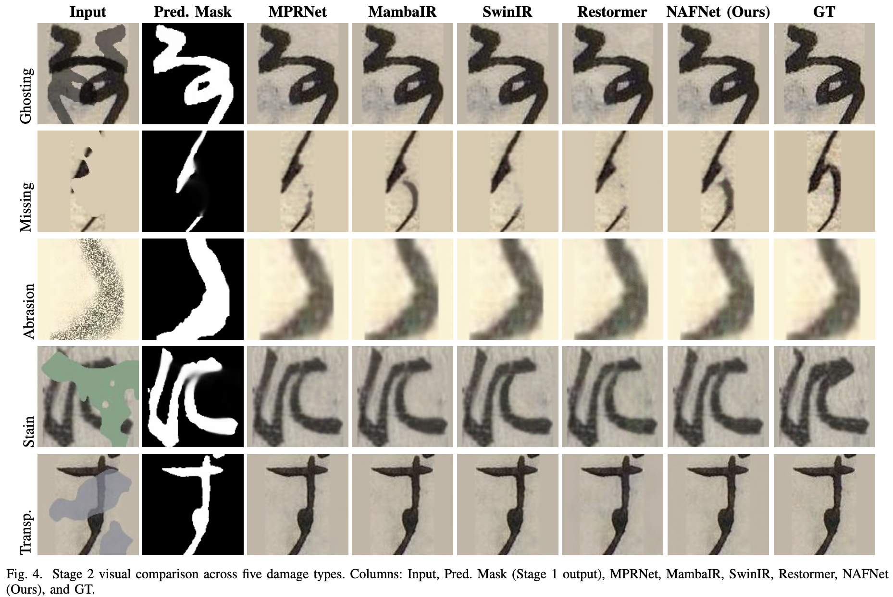

# Kuzushiji Restoration: Mask-Guided Two-Stage Framework

<p align="center">
  <a href="https://www.python.org/downloads/"></a>
  <a href="https://pytorch.org/"></a>
  <a href="LICENSE"></a>
  <a href="https://github.com/imoto135/Kuzushiji_Restoration/stargazers"></a>
  <a href="https://github.com/imoto135/Kuzushiji_Restoration/issues"></a>
</p>

> **個人研究プロジェクト** — 物理的に損傷した*くずし字*（古典日本語くずし字）文書の復元に向けた、マスクガイド付き二段階フレームワークの設計・実装・比較評価

---

## プロジェクト概要

歴史的な日本語文書（くずし字）は文化研究において非常に重要ですが、経年劣化（染み・欠損・にじみ等）によって可読性が大きく損なわれています。本プロジェクトでは、**「まず文字領域を推測し、その情報をヒントとして復元する」という二段階アプローチ**を独自設計し、5種の最先端アーキテクチャで比較検証しました。

**このプロジェクトで取り組んだ主なチャレンジ：**
- 汎用的な画像復元手法をドメイン固有（筆跡・細線）問題に適応させる
- ハードマスクではなくソフトマスクを導入し、劣化の曖昧さに対応
- OCR精度という実用指標まで含めた多面的な評価体制の構築
- Stage 1・Stage 2それぞれで損失関数・アーキテクチャ・マスク戦略を体系的にアブレーションし、設計判断を定量的に根拠づけ

---

## 結果

### 対象とする劣化パターン

<p align="center">
  
</p>
<p align="center">
  <em>(a) 汚れ(Stain) &nbsp;|&nbsp; (b) 半透明汚れ(Transparent Stain) &nbsp;|&nbsp; (c) 欠損(Missing) &nbsp;|&nbsp; (d) 裏写り(Ghosting) &nbsp;|&nbsp; (e)摩耗(Abrasion)</em><br>
  <sub>実際の古典文書に見られる5種類の物理的劣化。繊細な筆跡と重なるため、原本の墨跡との区別が困難。</sub>
</p>

### フレームワーク結果

<p align="center">
  
  &nbsp;&nbsp;
  
  &nbsp;&nbsp;
  
</p>
<p align="center">
  <em>左: フレームワーク概要 &nbsp;|&nbsp; 中: Stage 1 文字領域推定 &nbsp;|&nbsp; 右: Stage 2 復元結果</em>
</p>

---

## 🔬 技術的な取り組み (How)

### フレームワーク設計

```
損傷画像 (RGB)
    │
    ▼
[Stage 1] UNet++ → 文字領域ソフトマスク  M̂ ∈ [0, 1]
    │
    ▼ (RGB + Mask = 4ch入力)
[Stage 2] NAFNet / SwinIR / Restormer / MPRNet / MambaIR → 復元画像
```

**🔎 Stage 1 — 文字領域推定**  
UNet++ をベースに、ピクセルごとの文字領域確率を表す**ソフトマスク**を生成。バイナリマスクでは表現できない「グラデーションのある文字領域境界」を扱えるよう設計しました。

**🛠 Stage 2 — マスクガイド付き復元**  
予測マスクを第4チャンネルとして結合した **4ch入力**を採用し、損傷箇所の情報を復元モデルに明示的に与えます。

### 独自の工夫

| 工夫 | 内容 | 採用の理由 |
|:---|:---|:---|
| **ソフトマスク** | ハード二値化ではなく確率値 $\hat{M} \in [0,1]$ | 歴史文書の劣化は境界が曖昧で二値化による情報損失を防ぐため |
| **CharbPercep 損失** | Charbonnier Loss + Perceptual Loss の混合 | TV損失はくずし字の細かい筆跡を過度に平滑化することをアブレーションで確認 |
| **OCR評価の組込み** | PSNR/SSIM/LPIPS に加えてOCR精度で評価 | 視覚的品質だけでなく「実際に読めるか」という実用性を検証するため |
| **5種の劣化シミュレーション** | 欠損・染み・擦れ・重ね・透明染み | 実際の古文書に見られる多様な劣化パターンを網羅するため |
| **体系的アブレーション** | Stage 1（構造・正則化）・Stage 2（損失・マスク戦略）を独立に網羅的比較 | 設計選択の根拠を定量的に示し、直感的な設計判断を排除するため |

### 🧭 設計の思考プロセス

最終構成に至るまでの主要な判断を、採用しなかった選択肢も含めて記録します。

**Q1. なぜ「損傷領域」ではなく「文字領域」を推定するのか？**
損傷は5種類と多様で境界も曖昧なため、「損傷とは何か」をラベルとして定義すること自体が困難です。一方、文字領域なら清浄画像への大津の二値化で正解マスクを自動生成でき、アノテーションコストなしで大規模な学習データを構築できます。さらに「守るべき筆跡がどこか」を復元モデルに直接伝えられるため、筆跡保存という目的に合致すると判断しました。

**Q2. なぜソフトマスクか？**
かすれ・にじみを含むくずし字では文字と背景の境界が連続的で、二値化すると弱い筆跡の情報が失われます。確率値のまま第4チャンネルに渡すことで、文字領域の「確信度」まで Stage 2 に引き継げます。

**Q3. Stage 1 はどう改善したか？**
アーキテクチャ比較（DeepLabV3+ / U-Net / UNet++）→ 内部構造・正則化のアブレーションという2段階で最適化しました。注意機構（scSE）は背景ノイズと一緒にかすれた筆跡まで抑制してしまい逆効果、という失敗も経て、最終的に Coarse Dropout による「文脈からの形状補完能力の獲得」が最も有効という結論に至りました。

**Q4. 損失関数はなぜ CharbPercep か？**
初期の PSNR 損失ベースラインは PSNR/SSIM こそ高いものの LPIPS が劣り、筆跡の知覚的な再現が不十分でした。「読める復元」を優先するため LPIPS を主指標に据え、Charbonnier + Perceptual 損失へ変更。TV 損失の追加も試しましたが、細い筆跡の過剰平滑化を確認し不採用としました。アブレーションで PSNR 最高だったマスク Dropout 構成をあえて採用しなかったのも同じ理由です。

**Q5. なぜ OCR 精度まで評価するのか？**
画素指標の高さと「文字として読めるか」は必ずしも一致しないことを実験で確認したためです。復元の最終目的は翻刻・OCR の支援であり、下流タスクでの実用性を直接測る指標を評価に組み込みました。

---

## 📊 結果・評価

### 🔍 Stage 1 — マスク生成（UNet++ による文字領域推定）

**アーキテクチャ比較**（エンコーダー: SE-ResNeXt50 に統一、CD = Coarse Dropout）

| モデル | F1-score↑ | Hard IoU↑ | Soft IoU↑ | MAE↓ |
| :--- | :---: | :---: | :---: | :---: |
| DeepLabV3+ | 0.8295 | 0.7420 | 0.6986 | 0.0989 |
| U-Net | 0.9669 | 0.9409 | 0.9278 | 0.0180 |
| UNet++ | 0.9699 | 0.9472 | 0.9345 | 0.0176 |
| **UNet++ + CD (採用)** | **0.9719** | **0.9504** | **0.9406** | **0.0155** |

> **考察**: Coarse Dropout により、モデルが局所ピクセル強度だけでなく周辺の文脈情報からストローク位置を推定するよう促され、F1=0.9719 / Hard IoU=0.9504 を達成。

<details>
<summary><strong>UNet++ 内部構造アブレーション（クリックで展開）</strong></summary>

UNet++ (Encoder: SE-ResNeXt50) に対し、構造・正則化の各変更が精度に与える影響を体系的に検証しました。

| Configuration | F1-score↑ | Hard IoU↑ | Soft IoU↑ | MAE↓ |
| :--- | :---: | :---: | :---: | :---: |
| Baseline (Depth 5) | 0.9699 | 0.9472 | 0.9345 | 0.0176 |
| Depth 3 | 0.9698 | 0.9466 | 0.9353 | 0.0161 |
| Depth 4 | 0.9703 | 0.9479 | 0.9376 | 0.0163 |
| + scSE Module | 0.9690 | 0.9446 | 0.9329 | 0.0165 |
| + Half Channels + Head Dropout | 0.9702 | 0.9475 | 0.9388 | 0.0158 |
| Dropout (Last Layer only) | 0.9655 | 0.9359 | 0.9291 | **0.0123** |
| Head Dropout (0.5) | 0.9702 | 0.9475 | 0.9388 | 0.0158 |
| Input Dropout + Depth 4 | 0.9708 | 0.9487 | 0.9391 | 0.0159 |
| **Input Dropout + Depth 5 (採用)** | **0.9719** | **0.9504** | **0.9406** | 0.0155 |

- **深さ**: Depth 4 は過度なダウンサンプリングを避け MAE・Soft IoU が改善するが、Depth 3 は受容野不足で F1・Hard IoU が低下。Depth 5 + Input Dropout の組み合わせが最終的に最良。
- **scSE Module**: 背景ノイズ抑制の副作用として、かすれた文字領域まで過剰抑制が発生し IoU が低下。
- **Input Dropout (Coarse Dropout)**: 人工的に矩形領域を欠損させることで、局所テクスチャへの依存を排除し、周囲の文脈から文字形状を補完する能力を獲得。全変種中で最高の F1・Hard IoU を達成。

</details>

---

### 🖼 Stage 2 — 修復精度（ひらがな全文字、5種損傷データセット）

マスク条件 3種類で 5 モデルを比較：**NoMask**（ガイドなし）/ **PredMask**（提案手法）/ **GTMask**（理論上限）  
**太字**・<u>下線</u>は各マスク条件内でそれぞれ 1 位・2 位を示します。OCR精度はひらがな78クラスの ResNet-18 分類器で評価（ピーク検証精度 98.7%）。

| モデル | 条件 | mPSNR↑ | mSSIM↑ | LPIPS↓ | OCR精度↑ |
| :--- | :--- | :---: | :---: | :---: | :---: |
| **MPRNet** | NoMask | 33.32 | 0.9613 | <u>0.0222</u> | <u>97.86%</u> |
| | **PredMask (提案)** | **33.50** | <u>0.9627</u> | <u>0.0215</u> | **97.97%** |
| | GTMask (上限) | <u>35.92</u> | <u>0.9769</u> | **0.0158** | 98.38% |
| **MambaIR** | NoMask | 33.99 | 0.9653 | 0.0236 | 97.35% |
| | **PredMask (提案)** | 34.10 | 0.9660 | 0.0230 | 97.35% |
| | GTMask (上限) | **36.66** | **0.9805** | <u>0.0178</u> | <u>97.80%</u> |
| **SwinIR** | NoMask | <u>33.44</u> | <u>0.9618</u> | 0.0227 | 97.83% |
| | **PredMask (提案)** | **33.50** | **0.9632** | 0.0229 | <u>97.96%</u> |
| | GTMask (上限) | **35.94** | **0.9780** | <u>0.0174</u> | **98.42%** |
| **Restormer** | NoMask | 30.64 | 0.9543 | 0.0293 | **97.91%** |
| | **PredMask (提案)** | 31.47 | 0.9532 | 0.0289 | 97.92% |
| | GTMask (上限) | 33.17 | 0.9692 | 0.0229 | 98.36% |
| **NAFNet** | NoMask | **33.49** | **0.9622** | **0.0221** | **97.91%** |
| | **PredMask (提案)** | <u>33.21</u> | 0.9609 | **0.0205** | **97.97%** |
| | GTMask (上限) | 33.89 | 0.9705 | 0.0189 | <u>98.39%</u> |
| GT | — | — | — | — | 98.36% |
| LQ (損傷入力) | — | 19.33 | 0.7168 | 0.2855 | 81.23% |

> **考察**: NAFNet は PredMask 条件で LPIPS=0.0205（最良）・OCR=97.97%（最良タイ）を達成。局所ゲーティング機構が不完全マスクによる誤差伝播を抑制するため、実用条件で最も安定した性能を示す。MambaIR は GTMask 条件で mPSNR・mSSIM が最高値を記録するが、PredMask への性能低下幅（36.66→34.10 dB）が最大であり、SSM の大域受容野がマスク不精度に敏感であることを示す。GTMask–PredMask ギャップは Stage 1 精度が依然としてパイプライン全体のボトルネックであることを示す。

<details>
<summary><strong>Stage 2 損失関数・マスク戦略アブレーション（NAFNet、クリックで展開）</strong></summary>

NAFNet を用いて損失関数とマスク入力戦略の各変種を比較しました。

| 手法 | LPIPS↓ | PSNR↑ | Masked PSNR↑ | SSIM↑ | Masked SSIM↑ |
| :--- | :---: | :---: | :---: | :---: | :---: |
| **charbpercep (採用)** | **0.0205** | 36.688 | 33.212 | 0.9650 | 0.9609 |
| TVLoss | 0.0209 | 36.614 | 33.118 | 0.9645 | 0.9608 |
| predmask_baseline | 0.0255 | 37.436 | 34.095 | 0.9705 | 0.9660 |
| EdgeOnly | 0.0252 | 37.407 | 33.925 | 0.9699 | 0.9654 |
| dropout | 0.0259 | **37.556** | **34.159** | **0.9708** | **0.9667** |
| nomask | 0.0267 | 37.401 | 34.054 | 0.9703 | 0.9657 |
| MaskMorph | 0.0310 | 34.951 | 30.931 | 0.9543 | 0.9417 |

各手法の概要：
- **charbpercep**: Charbonnier Loss + Perceptual Loss (λ=0.1) の混合損失
- **TVLoss**: charbpercep に Total Variation 損失をさらに追加した変種
- **predmask_baseline**: 予測マスクを第4チャンネルとして入力するベースライン（PSNR Loss）
- **EdgeOnly**: Charbonnier + Sobel ベースの EdgeAware Loss（ストローク鮮明化を目的）
- **dropout**: 学習時に10%の確率でマスクチャンネル全体をゼロ化し、マスクなし条件への汎化を促進
- **nomask**: マスクなし（3ch RGB のみ）
- **MaskMorph**: 学習時にマスクをランダムに膨張/収縮させるデータ拡張（境界誤差への頑健性向上）

PSNR・SSIM では dropout が最高値を記録するが、**LPIPS（知覚的類似度）では charbpercep が最良**。くずし字の細いストロークの知覚品質を重視し、TVLoss がストローク構造を過剰に平滑化することをアブレーションで確認したため、charbpercep を採用。

</details>

---

### 3. OCR評価の詳細（`models/classifier/`）

視覚品質指標（PSNR/SSIM/LPIPS）だけでなく、「実際に文字として読めるか」という実用指標を加えるため、くずし字分類器を独自に設計・学習しました。

| 項目 | 内容 |
|:---|:---|
| **アーキテクチャ** | ResNet-18（ImageNet事前学習済み、最終FC層を差し替えてFine-tuning） |
| **分類クラス数** | 78クラス（ひらがな文字種） |
| **学習データ** | 訓練: 108,536枚 / 検証: 13,567枚 |
| **入力前処理** | グレースケール→RGB変換、224×224リサイズ、RandomRotation (±10°)・RandomAffine (translate=0.1)・ImageNet正規化 |
| **最適化** | SGD (momentum=0.9, weight_decay=1e-4)、ReduceLROnPlateau (factor=0.1, patience=2) |
| **Early Stopping** | patience=5、Epoch 12 で収束 |
| **検証精度** | **98.7%** |

> 実装: [models/classifier/train_classifier.py](models/classifier/train_classifier.py) / 推論: [models/classifier/evaluate_restoration_hiragana.py](models/classifier/evaluate_restoration_hiragana.py)

この分類器を復元画像に適用してOCR精度を算出することで、復元手法の「文字認識への実用的な貢献度」を定量評価しています。ただし評価を78クラスのひらがなに限定しているため、損傷入力でも81.23%という比較的高いベースラインとなり、アーキテクチャ間の差が圧縮される点に注意が必要です。より広い文字種での評価により、モデル間の差異がより明確に現れることが期待されます。

---

### 4. 計算効率（NVIDIA RTX A6000、128×128×4 入力）

**太字**・<u>下線</u>は各指標の 1 位・2 位を示します。

| モデル | パラメータ数 (M)↓ | FLOPs (G)↓ | レイテンシ (ms)↓ |
| :--- | :---: | :---: | :---: |
| **MPRNet** | <u>2.94</u> | 132.3 | <u>27.9</u> |
| **MambaIR** | **1.48** | <u>21.9</u> | 69.5 |
| **SwinIR** | 11.90 | 29.4 | 56.7 |
| **Restormer** | 26.13 | 85.9 | 64.4 |
| **NAFNet** | 29.16 | **8.0** | **24.6** |

> NAFNet はパラメータ数は最大だが、FLOPs=8.0G・レイテンシ=24.6ms で最も高速かつ低計算コスト。LPIPS・OCR精度でも最良であり、**大規模デジタル化ワークフローにおいて精度と効率のバランスに最も優れたモデル**と評価しています。

---

## 🛠 技術スタック

<p align="center">
  
  
  
  
  
  
  
</p>

| カテゴリ | 技術 |
|:---|:---|
| **Deep Learning** | PyTorch, BasicSR |
| **復元モデル** | NAFNet, SwinIR, Restormer, MPRNet, MambaIR |
| **検出モデル** | UNet++ (SE-ResNeXt-50 バックボーン) |
| **評価指標** | PSNR, SSIM, LPIPS, OCR (ResNet-18 分類器) |
| **実験管理** | Weights & Biases (wandb) |
| **環境** | Docker, Conda, NVIDIA RTX A6000 |

---

## 📁 プロジェクト構成

```
Kuzushiji_Restoration/
├── configs/                   # 各モデルの学習設定 (YAML)
├── models/
│   ├── nafnet/                # NAFNet 実装 (BasicSRベース)
│   ├── swinir/                # SwinIR 実装
│   ├── restormer/             # Restormer 実装
│   ├── mprnet/                # MPRNet 実装
│   ├── mamba/                 # MambaIR 実装
│   ├── unet++/                # Stage 1: 文字領域推定
│   ├── classifier/            # OCR評価用分類器
│   └── joint/                 # Joint End-to-End 学習
├── scripts/
│   ├── data_preprocessing/    # 前処理: パディング・Otsuマスク生成・劣化合成
│   ├── evaluation/            # 評価: PSNR / SSIM / LPIPS / OCR
│   └── inference/             # 推論スクリプト
└── data/
    └── hiragana_fulldataset_5stain/
        ├── gt/                # 正解画像
        ├── lq/                # 劣化入力画像
        ├── gt_mask/           # GTマスク (Otsu二値化)
        └── pred_mask/         # Stage 1 予測ソフトマスク
```

---

## 🚀 セットアップ & 実行方法

### 環境構築

**Conda（推奨）**

```bash
git clone https://github.com/imoto135/Kuzushiji_Restoration.git
cd Kuzushiji_Restoration
conda create -n nafnet_env python=3.10
conda activate nafnet_env
conda install pytorch==2.5.1 torchvision==0.20.1 pytorch-cuda=12.1 -c pytorch -c nvidia
pip install numpy==1.26.4 opencv-python Pillow pyyaml tqdm scipy scikit-image \
            matplotlib lpips thop wandb einops timm addict future lmdb ipython \
            segmentation-models-pytorch albumentations
```

**Docker**（`docker` コマンドが利用可能な環境のみ）

```bash
docker compose build
docker compose run --rm kuzushiji bash
```

### データ前処理

```bash
python scripts/data_preprocessing/01_pad_images.py          # パディング・128×128リサイズ
python scripts/data_preprocessing/02_generate_otsu_masks.py # GTマスク生成 (Otsu二値化)
python scripts/data_preprocessing/03_add_stain_5types.py    # 劣化合成 (5種)
```

### 学習

重みファイルは容量の都合上リポジトリに含めていません。以下の手順で再現できます。

**Stage 1: UNet++ （文字領域推定）**

```bash
python models/unet++/train.py \
    --data_dir data \
    --output_dir models/unet++/experiments/unet++_kuzushiji \
    --epochs 50 --batch_size 16
```

**Stage 2: NAFNet （復元モデル）**

```bash
# BasicSR の設定ファイルを使用
python models/nafnet/run_train.py \
    -opt models/nafnet/options/Kuzushiji/NAFNet_Kuzushiji_predmask.yml
```

**Stage 2: MambaIR**

```bash
python models/mamba/train_mamba_5stain.py \
    --data_dir data \
    --mask_type predmask \
    --output_dir models/mamba/experiments/MambaIR_5stain_Predmask
```

### 推論

```bash
# Stage 1: 文字領域マスク予測
python scripts/inference/predict_mask_unetpp.py \
    --input_dir data/lq/test \
    --output_dir data/pred_mask/test \
    --model_path models/unet++/experiments/unet++_kuzushiji/best_model.pth

# Stage 2: NAFNet による復元
python scripts/restore.py \
    --model_type nafnet \
    --weights models/nafnet/experiments/NAFNet_predmask/best_model.pth \
    --input_dir data/lq/test \
    --output_dir outputs/nafnet_test \
    --mask_dir data/pred_mask/test

# Stage 2: MambaIR による復元
python models/mamba/restore_mamba_5stain.py \
    --mask_type predmask \
    --weights models/mamba/experiments/MambaIR_5stain_Predmask/best_model.pth \
    --input_dir data/lq/test \
    --mask_dir  data/pred_mask/test \
    --output_dir outputs/mambair_test
```

### 評価

```bash
python scripts/evaluation/calculate_5metrics.py \
    --gt_dir data/gt/test \
    --pred_dir outputs/nafnet_test \
    --mask_dir data/gt_mask/test \
    --output_csv outputs/nafnet_metrics.csv \
    --use_wandb
```

---

## 📚 参考文献

### モデルアーキテクチャ
- **NAFNet**: Chen et al., "Simple Baselines for Image Restoration", ECCV 2022 [[Paper]](https://arxiv.org/abs/2204.04676)
- **MPRNet**: Zamir et al., "Multi-Stage Progressive Image Restoration", CVPR 2021 [[Paper]](https://arxiv.org/abs/2102.02808)
- **SwinIR**: Liang et al., "SwinIR: Image Restoration Using Swin Transformer", ICCV 2021 [[Paper]](https://arxiv.org/abs/2108.10257)
- **Restormer**: Zamir et al., "Restormer: Efficient Transformer for High-Resolution Image Restoration", CVPR 2022 [[Paper]](https://arxiv.org/abs/2111.09881)
- **MambaIR**: Guo et al., "MambaIR: A Simple Baseline for Image Restoration with State-Space Model", ECCV 2024 [[Paper]](https://arxiv.org/abs/2402.15648)
- **UNet++**: Zhou et al., "UNet++: A Nested U-Net Architecture for Medical Image Segmentation" [[Paper]](https://arxiv.org/abs/1807.10165)

### データセット
- **くずし字データセット**: 人文学オープンデータ共同利用センター (CODH)

---

## ⚖️ ライセンス

本プロジェクトは MIT ライセンスのもとで公開しています。

**サードパーティライセンス**
- BasicSR: [Apache License 2.0](https://github.com/XPixelGroup/BasicSR/blob/master/LICENSE)
- NAFNet, SwinIR: Apache License 2.0
- MPRNet, Restormer: MIT License

---

## 👤 作者

**Imoto** — [@imoto135](https://github.com/imoto135)
